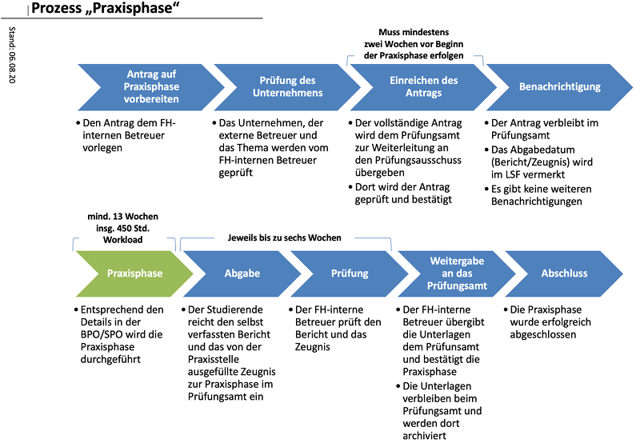
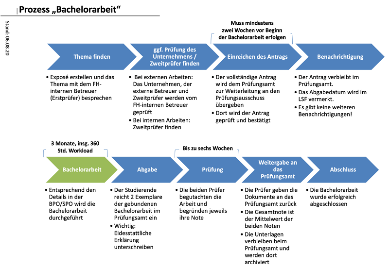

- [FAQ: Praxisphase und Abschlussarbeit](#faq-praxisphase-und-abschlussarbeit)
  - [Überblick Prozess Praxisphase](#überblick-prozess-praxisphase)
  - [Überblick Prozess Bachelorarbeit](#überblick-prozess-bachelorarbeit)
  - [Wichtige Dokumente und Anträge](#wichtige-dokumente-und-anträge)
  - [Weitere Bemerkungen](#weitere-bemerkungen)
  - [Erklärvideo](#erklärvideo)
  - [Credits](#credits)
  - [License](#license)
  - [Quellen und Links](#quellen-und-links)

# FAQ: Praxisphase und Abschlussarbeit

## Überblick Prozess Praxisphase

<figure>

<figcaption aria-hidden="true">Überblick Prozess Praxisphase; Quelle: ursprünglicher Entwurf von Jörn Steinhauer, weiterentwickelt von Christiane Seele (Prüfungsamt Informatik, Minden), neu gezeichnet und weiterentwickelt <a href="https://github.com/cagix">Carsten Gips</a></figcaption>
</figure>

## Überblick Prozess Bachelorarbeit

<figure>

<figcaption aria-hidden="true">Überblick Prozess Bachelorarbeit</figcaption>
</figure>

## Wichtige Dokumente und Anträge

Sie finden die wichtigsten Dokumente und Anträge auf der HSBI-Webseite unter
[Ordnungen und weitere Dokumente](https://www.hsbi.de/studiengaenge/downloads/informatik-bachelor).

## Weitere Bemerkungen

Dieses Dokument soll Ihnen die wichtigsten Fragen rund um die Praxisphase und die Bachelorarbeit
beantworten. Im Interesse der leichteren Lesbarkeit und Verständlichkeit wurden einige
Vereinfachungen vorgenommen:

- Das “Prüfungsamt” ist neuerdings als “Studierendenservice” bekannt.
- In der vorliegenden ersten Version dieses Studiengang-internen Dokuments wurde zunächst der
  Fokus auf die Inhalte und die Lesbarkeit/Verständlichkeit gelegt. Natürlich sollen ALLE
  angesprochen werden, d.h. mit “Betreuer” sind auch Betreuerinnen gemeint, mit “Prüfer” auch
  alle Prüferinnen, mit “Dozent” auch alle Dozentinnen, …

## Erklärvideo

[Direkt-Link HSBI-Medienportal](https://www.hsbi.de/medienportal/m/b91f1872f5727abc899606ab4fdf23bb2d068fbdf61b6b59e4e25254de7272eb5528d8b9721b6bdaa99796527d0fb9673022ee83d6b4d2d19e83b827fd9d55a7)

## Credits

- Autor: [Carsten Gips](https://github.com/cagix)
- Beiträge:
  - Christiane Seele (Abbildung Prozess Praxisphase, Reviews)
  - [BC George](https://github.com/bcg7) (Reviews)
  - [Matthias König](https://github.com/U2654) (Reviews, URL HSBI-Stellenportal, Hinweis BA baut
    üblicherweise auf Praxisphase auf)
  - [Angela Kreienkamp](https://github.com/kreienkamp) (Word-Version)

## License

Unless otherwise noted, <a href="https://github.com/cagix/faq-praxisphase-abschlussarbeit">this work</a> by <a xmlns:cc="https://creativecommons.org/ns#" href="https://github.com/cagix" property="cc:attributionName" rel="cc:attributionURL">Carsten Gips</a> and <a href="https://github.com/cagix/faq-praxisphase-abschlussarbeit/graphs/contributors">contributors</a> is licensed under <a rel="license" href="https://github.com/cagix/faq-praxisphase-abschlussarbeit/blob/master/LICENSE.md">CC BY-SA 4.0</a>.

## Quellen und Links

------------------------------------------------------------------------

Unless otherwise noted, this work is licensed under CC BY-SA 4.0.

Stand: 27.06.2023;
Quellen: https://github.com/cagix/faq-praxisphase-abschlussarbeit
