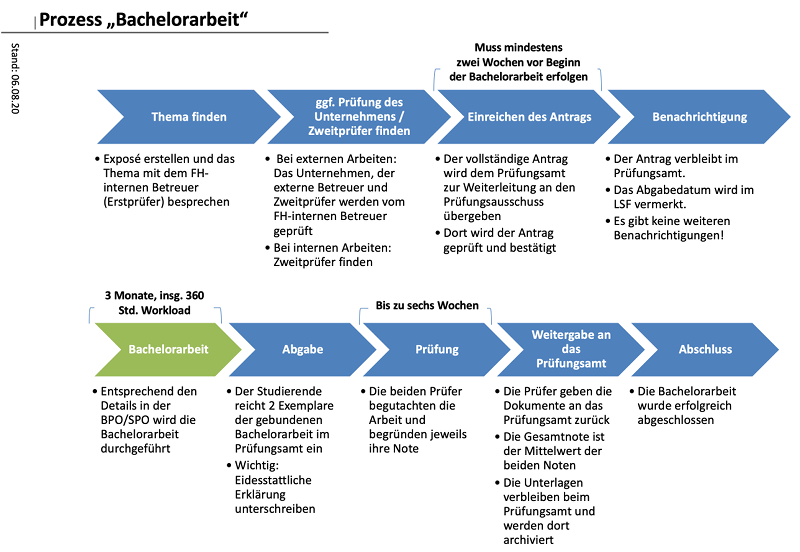

## Worum geht es in der Bachelorarbeit?

::: notes
Die Bachelorarbeit wird in der Prüfungsordnung geregelt:

-   @RPO-BA:
    -   Kapitel "V. Bachelorarbeit"
-   @SPO-BA23:
    -   §22 bis §26
    -   Modulbeschreibung zum Modul "Bachelorarbeit"
-   @SPO-BA18:
    -   §23 bis §27
    -   Modulbeschreibung zum Modul "Bachelorarbeit"
:::

### Ziel

Selbstständige Bearbeitung einer praxisorientierten Aufgabe im Fachgebiet mit wissenschaftlichen
Methoden innerhalb einer vorgegebenen Frist

\bigskip

### Umfang

3 Monate [(12 Wochen)]{.notes} mit 12 ECTS Arbeitsaufwand (Vollzeit, ohne Unterbrechung: 360h)

## Wo kann ich meine Bachelorarbeit durchführen?

### Extern: Firma

::: notes
Häufig wird die Bachelorarbeit in einer Firma durchgeführt.

Dazu wird in der Regel ein Vertrag zwischen Ihnen und der Firma abgeschlossen, in dem auch die
Vertragslaufzeit, wöchentliche Arbeitszeit und das Entgeld geregelt werden.

**Hinweis:** Dieser Vertrag ist Ihre Privatangelegenheit und hat nichts mit der Prüfungsleistung
"Bachelorarbeit" an der HSBI zu tun. Im Extremfall kann sich beispielsweise die Vertragslaufzeit
deutlich von der Bearbeitungszeit der Bachelorarbeit (Zeitraum zwischen Anmeldung/Genehmigung und
Beendigung) unterscheiden!
:::

\smallskip

### Intern: Labor oder Forschungsprojekt

::: notes
Sie können je nach Angebot die Bachelorarbeit aber auch in der Hochschule in einem Labor oder einem
Forschungsprojekt durchführen. Sprechen Sie die Dozent:innen bei Interesse rechtzeitig an.

Häufig absolvieren Sie hier lediglich die Prüfungsleistung, d.h. Sie werden nicht im Labor oder
Forschungsprojekt eingestellt.
:::

\bigskip

### Betreuer:innen und Prüfer:innen

-   Erstprüfer:in: Dozent:in im Studiengang (HSBI)
-   Zweitprüfer:in:
    -   externe Arbeiten: i.d.R. Betreuer:in in der Firma
    -   interne Arbeiten: Dozent:in aus dem Studiengang

::: notes
Für die Rolle als Zweitprüfer:in müssen die Personen mindestens den angestrebten Abschluss oder eine
vergleichbare Qualifikation haben [vgl. @RPO-BA{}, §10 (1)].

Sie müssen sich selbst um Erstprüfer:in und Zweitprüfer:in kümmern und diese auf Ihrem
Antrag auf Zulassung zur Bachelorarbeit [@AntragBA] angeben und unterschreiben lassen.
:::

## Wie finde ich ein Thema und Betreuer?

-   **Nutzen Sie die Praxisphase: Kontakt in der jeweiligen Firma!**

\smallskip

-   Eigeninitiative, Initiativbewerbung
-   "Frag den Prof": Ordnen Sie Ihr Interessengebiet dem Arbeitsgebiet zu und sprechen Sie die
    passenden Dozenten:innen rechtzeitig an
-   Mint-Mentoring [[@MintMentoring] ([Details siehe Folie zum Mint-Mentoring](faq_praxisphase.md#detailsmint))]{.notes}
-   Stellenanzeigen (Internet, Zeitungen, HSBI-Stellenportal[ [@Stellenportal]]{.notes}, Schwarze Bretter)

## Wie starte ich in meine Bachelorarbeit?

{width="80%"}

::: notes
1.  Kontakt mit gewünschter Firma oder Labor bzw. Forschungsprojekt aufnehmen, ggf.
    Bewerbungsprozess durchlaufen

2.  Kontakt mit potentieller Betreuer:in/Erstprüfer:in in der HSBI (Dozent:in) aufnehmen
    -   Gute Chancen: Thema passt zum Arbeits-/Forschungsgebiet der Betreuer:in
    -   Gute Chancen: Sie kümmern sich frühzeitig (die Zeitbudgets für die Betreuung sind
        begrenzt)

3.  Ggf. Zweitprüfer:in an HSBI (Dozent:in) suchen (i.d.R. nur bei internen Arbeiten)

4.  Abstimmung bzgl. des Themas zwischen Erst- und Zweitprüfer:innen und Kandidat:in
    -   Erstellen Sie ein Exposé (PDF, 1-3 Seiten): Problem, Ausgangspunkt, Ziel, wichtige
        Meilensteine, relevante Methoden und Technologien, grober Zeitplan, Risiken
    -   Organisieren Sie die Abstimmung

5.  Antrag auf Zulassung zur Bachelorarbeit [@AntragBA] ausfüllen, Unterschrift Zweitprüfer:in
    einholen und an Erstprüfer:in schicken (als PDF per Mail)
    -   Bitte das PDF am Rechner ausfüllen (nicht handschriftlich)
    -   Den Antrag selbst unterschreiben
    -   Den Antrag von Zweitprüfer:in unterschreiben lassen
    -   Den Antrag als PDF an Erstprüfer:in mailen
    -   Erstprüfer:in unterschreibt und leitet den Antrag an den Studierendenservice weiter
    -   Bei Genehmigung erscheint nach bis zu zwei Wochen ein entsprechender Eintrag im LSF

**Hinweise**:

-   Sie müssen sich selbst um Erst- und Zweitprüfer:innen und die Abstimmung des Themas bemühen. Oft
    gibt es bereits Vorschläge für mögliche Bachelorarbeiten, aber Sie können i.d.R. auch eigene
    Ideen einbringen. Das Exposé soll die Abstimmung erleichtern und Ihnen helfen, über das Thema
    Klarheit zu gewinnen. Es soll grob die Arbeit und die angestrebten Ergebnisse beschreiben - Sie
    sollen die potentielle Bachelorarbeit aber noch nicht durchführen!
-   Zwischen der Einreichung im Studierendenservice und der Annahme des Antrags (Start der
    Bachelorarbeit) können bis zu zwei Wochen liegen. Es gibt keine weiteren Briefe oder Mails. Wenn
    der Antrag angenommen ist, beginnt die Bearbeitungszeit und Sie sehen im LSF das spätestmögliche
    Abgabedatum. Bei Ablehnung des Antrags erhalten Sie einen Brief vom Studierendenservice.
:::

::: notes
## Voraussetzungen für die Anmeldung der Bachelorarbeit

-   Sie haben die Modulprüfungen bis auf vier bestanden [vgl. @SPO-BA18{}, §10 (1)]
-   Sie haben eine Person aus dem Kreis der Dozent:innen im Studiengang gefunden, die bereit ist,
    Ihre Bachelorarbeit zu betreuen ("HSBI-interne Betreuer:in") und die Rolle der Erstprüfer:in zu
    übernehmen
-   Sie haben eine geeignete Person gefunden, die die Rolle der Zweitprüfer:in übernehmen kann
    -   bei externen Bachelorarbeiten i.d.R. die Betreuer:in in der Firma
    -   bei internen Bachelorarbeiten eine weitere Person aus dem Kreis der Dozent:innen im
        Studiengang
-   Das Thema ist geeignet (Prüfung durch die HSBI-interne Betreuer:in) und ist unter allen
    Beteiligten abgesprochen
:::

## Welche Termine gibt es während der Bearbeitungszeit?

Das ist abhängig von Ihren Betreuer:innen. Besprechen Sie dies rechtzeitig mit beiden Prüfer:innen!

**Hinweis**: Es bietet sich an, regelmäßig den Kontakt zu beiden Prüfer:innen zu suchen und sie über
den Stand der Arbeiten zu informieren!

## Aufbau der Arbeit? Gibt es eine Vorlage?

-   Anforderungen gemäß Studiengangsprüfungsordnung: Seitenumfang 30 bis 80 Seiten
    [[@SPO-BA18{} §23 (2); @SPO-BA23{} §22 (2)]]{.notes}

    ::: notes
    Es zählen nur die reinen Textseiten. Etwaige Titelseiten, Verzeichnisse und Anhänge zählen hier
    nicht mit. Eine Seite hat zwischen 300 und 400 Wörter [vgl. @SPO-BA18{}, §9 (1)].

    Benutzen Sie Standardeinstellungen bzgl. Schriftgröße, Seitenränder und Zeilenabstände.
    Sprechen Sie dies mit Ihren Prüfer:innen ab!
    :::

\smallskip

-   Gliederung, Aufbau: Stil einer Abschlussarbeit mit wissenschaftlichem Anspruch

    ::: notes
    Die Bachelorarbeit sollte im Stil einer Abschlussarbeit mit entsprechend wissenschaftlichem
    Anspruch verfasst werden: Auf die Ich-Form sollte verzichtet werden.

    Inhaltlich sollten Sie die üblichen Punkte behandeln:
    -   Einleitung: u.a. Beschreibung der Aufgabe(n) und (Unternehmens-) Umfeld
    -   Hauptteil: Problem, Analyse, Techniken, Lösungsansatz und Umsetzung
    -   Zusammenfassung/Resümee, Ausblick
    -   Quellen (vgl. auch Fachseminar)
    :::

\smallskip

-   Vorlage: Absprache mit Prüfer:innen

    ::: notes
    Sie können hier auch die Vorlage für Abschlussarbeiten [@TemplateBA] einsetzen.
    Dies bietet mehrere Vorteile:
    -   Typische Gliederung ist bereits eingebaut
    -   Hinweise zu typischen Umfängen als Kommentar in den Beispieldateien vorhanden
    -   Schreiben der Arbeit in Markdown und Übersetzung mit Pandoc+LaTeX+auswählbarem Style
        nach PDF (Toolchain wird als Docker-Container bereitgestellt)
    :::

\smallskip

-   Weitere Hinweise zum Aufbau einer Abschlussarbeit sowie zum Zitieren etc. finden Sie
    beispielsweise in @Balzert2022

\bigskip

**Wichtig**: Besprechen Sie dies rechtzeitig mit den beiden Prüfer:innen!

## Was muss ich hinterher einreichen?

-   Formale Abgabe: Online über "Einreichung von schriftlichen Arbeiten" [[@EinreichungBA]]{.notes}
    -   Schriftliche Ausarbeitung (30 bis 80 Seiten) als PDF
    -   Unterschriebene Eigenständigkeitserklärung [[@EigenSperrBA]]{.notes} im PDF

\smallskip

-   Bitte senden Sie zusätzlich eine Kopie an beide Prüfer:innen

::: notes
Ihre Bachelorarbeit müssen Sie **fristgerecht** (vor Ablauf der Abgabefrist) beim
Studierendenservice einreichen. Dies geschieht derzeit über die HSBI-Webseite
"Einreichung von schriftlichen Arbeiten" [@EinreichungBA].
Sie erhalten eine Bestätigungsmail mit dem Zeitstempel - bitte bewahren Sie diese
Mail auf.

Achten Sie darauf, dass Sie eine unterschriebene Eigenständigkeitserklärung [@EigenSperrBA]
in der Arbeit (PDF) unterbringen müssen.

In der alten Prüfungsordnung steht noch, dass Sie fristgerecht zwei ausgedruckte
und gebundene Exemplare beim Studierendenservice einreichen müssen und die
Online-Abgabe lediglich _zusätzlich_ erfolgt [vgl. @SPO-BA18{}, §26]. Die gelebte
Praxis ist aber, dass Sie nur ein PDF online abgeben.
**Besprechen Sie dies bitte rechtzeitig von Abgabe mit Ihrer Erstprüfer:in!**
In der neuen Prüfungsordnung findet sich nur noch die elektronische Abgabe
[@SPO-BA23{}, §25].
:::

## Hinweise Sperrvermerk und Source-Code

-   Sensible Unternehmensdaten: Sperrvermerk einfügen (Absprache mit der Firma!)

    ::: notes
    Bei Ergebnissen aus dem Unternehmen, die zwar in den schriftlichen Bericht gehören, aber nicht
    veröffentlicht werden sollen, fügen Sie dem Bericht einen "Sperrvermerk" an.

    Fügen Sie dazu beispielsweise den folgenden Text auf der Seite direkt nach dem Titelblatt mit
    entsprechenden Änderungen ein: "Dieser Bericht enthält vertrauliche Daten der Firma XYZ (Name
    des Unternehmens). Veröffentlichungen oder Vervielfältigungen der Arbeit -- auch nur
    auszugsweise -- sind ohne ausdrückliche Genehmigung der beteiligten Unternehmen nicht gestattet.
    Die Arbeit ist nur den Prüfern bzw. den Korrektoren sowie den Mitgliedern des
    Prüfungsausschusses bzw. der oder dem Prüfungsbeauftragten zugänglich zu machen".

    In der Vorlage für Abschlussarbeiten [@TemplateBA] ist ein Sperrvermerk bereits vorgesehen
    und kann einfach aktiviert werden. Sie finden auch auf der zweiten Seite des Formulars der
    Eigenständigkeitserklärung einen entsprechenden Vordruck [@EigenSperrBA].

    Sprechen Sie die Notwendigkeit eines solchen Sperrvermerks rechtzeitig mit Ihrem Unternehmen
    ab! Informieren Sie auch Ihre Erstprüfer:in.
    :::

\smallskip

-   Quellcode: Sprechen Sie mit den Prüfer:innen ab, wie mit dem erstellten Quellcode und
    anderen in der Bachelorarbeit erstellten prüfungsrelevanten Artefakten umzugehen ist

    ::: notes
    Beispiel: Abgabe als CD in der Arbeit oder ein Link auf ein für die Prüfer:innen
    zugreifbares Repo.
    :::

## Bekomme ich eine Note?

JA :-)

::: notes
Die beiden Prüfer:innen benoten Ihre Arbeit unabhängig voneinander. Sie erhalten als Note auf
dem Zeugnis den Mittelwert der beiden Noten. Ausnahme: Wenn die Notendifferenz einen bestimmten
Wert überschreitet, wird noch eine dritte Prüfer:in hinzugezogen.

Sprechen Sie rechtzeitig mit Ihren Betreuer:innen über mögliche individuelle Anforderungen.
:::

## Was muss ich sonst noch beachten?

### Start

-   Bearbeitung der Bachelorarbeit nicht an Vorlesungszeiten gebunden
-   Beachten Sie die Fortschrittsregelung [[vgl. @SPO-BA18{} §24; @SPO-BA23{} §23]]{.notes}
-   Beginn nicht frei wählbar: Die Bearbeitungszeit beginnt, sobald [der]{.notes} Antrag
    angenommen wurde
-   Bachelorarbeit und Praxisphase können nicht gleichzeitig/parallel
    durchgeführt/bearbeitet werden [(Sie können die Bachelorarbeit aber in der 6-wöchigen
    Abgabefrist für den Praxisphasenbericht beantragen und beginnen.)]{.notes}

\smallskip

### Verlängerung der Bearbeitungszeit in Ausnahmefällen

-   Antrag auf Fristverlängerung beim vorsitzenden Mitglied des Prüfungsausschusses stellen
    (Nachweise!) [[vgl. @RPO-BA{}, § 28 (3)]]{.notes}

    ::: notes
    Bei während der Bearbeitungsfrist eintretenden Ausnahmefällen (etwa eine akute Erkrankung,
    die die weitere Bearbeitung der Bachelorarbeit temporär stark erschwert oder unmöglich
    macht), kann der Prüfungsausschuss auf einen vor Ablauf der Frist gestellten begründeten
    Antrag die Bearbeitungszeit um bis zu drei Wochen verlängern.

    Nutzen Sie dazu das Formular: Antrag auf Fristverlängerung [@VerlBA].

    Wichtig: Die angeführten Gründe müssen geeignet nachgewiesen werden!
    :::

\smallskip

### Nachteilsausgleich

-   Bei Einschränkungen durch gesundheitliche Probleme oder Familienaufgaben können Sie einen
    Nachteilsausgleich beantragen

    ::: notes
    Siehe [FAQ zum Nachteilsausgleich](faq_nachteilsausgleich.md)
    :::

::: slides
* * * * *
**Viel Erfolg :-)**
:::
