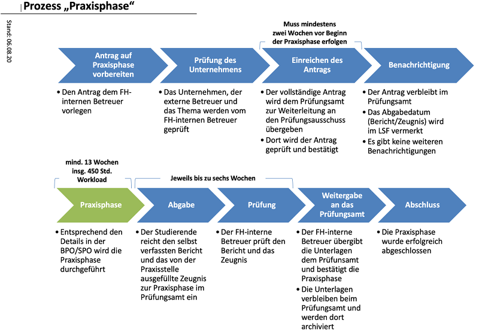

- [FAQ: Praxisphase](#faq-praxisphase)
  - [Überblick und Einordnung](#überblick-und-einordnung)
  - [Vorbereitung](#vorbereitung)
  - [Während der Praxisphase](#während-der-praxisphase)
  - [Abgabe](#abgabe)
  - [Sonstige Hinweise](#sonstige-hinweise)
  - [Quellen und Links](#quellen-und-links)

# FAQ: Praxisphase

## Überblick und Einordnung

### Worum geht’s in der Praxisphase?

Die Praxisphase wird in der Studiengangsprüfungsordnung (SPO) ([\[1\]](#ref-SPO-BA23) §20) sowie
der Rahmenprüfungsordnung (Bachelor) ([\[2\]](#ref-RPO-BA) §24) geregelt.[^1]

**Ziel**: Kennenlernen der beruflichen Praxis von Informatiker:innen durch konkrete
Aufgabenstellungen und praktische Mitarbeit, Anwendung der im bisherigen Studium
erworbenen Kenntnisse und Fähigkeiten (vgl. [\[2\]](#ref-RPO-BA) §24 (1))

**Umfang**: 13 Wochen mit 18 ECTS Arbeitsaufwand (Arbeitszeit 450h)

**Hinweis**: Häufig werden Praxisphase und Bachelorarbeit aufeinander aufbauend kombiniert

Sie lernen in der Praxisphase die Firma oder das Projekt genauer kennen und können dabei
gemeinsam mit den Betreuer:innen die Bachelorarbeit thematisch eingrenzen.

### Wo kann ich meine Praxisphase durchführen?

**Extern**: Firma

Die Durchführung der Praxisphase in einer Firma ist der Standardfall. Sie haben hier den
Vorteil, dass Sie während der Praxisphase die Firma genauer kennen lernen und Kontakte
knüpfen können, die Sie später für die Bachelorarbeit nutzen können. Außerdem wird in der
Regel die Tätigkeit im Rahmen der Praxisphase von den Firmen vergütet.

**Hinweis:** In der Regel wird dazu ein Vertrag zwischen Ihnen und der Firma abgeschlossen.
Dieser Vertrag ist Ihre Privatangelegenheit und hat nichts mit der (Anmeldung zur)
Prüfungsleistung zu tun. Im Extremfall kann sich beispielsweise die Vertragslaufzeit
deutlich von der Bearbeitungszeit der Praxisphase (Zeitraum zwischen Anmeldung/Genehmigung
und Beendigung) unterscheiden!

**Intern**: Labor, Forschungsprojekt, o.ä.

In selteneren Fällen wird die Praxisphase HSBI-intern in einem Labor oder einem
Forschungsprojekt durchgeführt. Dabei entfällt in der Regel eine Entlohnung, da hierfür
oft keine Mittel bereitstehen.

=\> **Wichtig**: In jedem Fall wird ein:e Betreuer:in in der HSBI (Dozent:in) benötigt!

### Zeitlicher Ablauf Praxisphase

<figure>

<figcaption aria-hidden="true">Zeitlicher Ablauf Praxisphase (Quelle: Studierendenservice, C. Seele)</figcaption>
</figure>

Es lassen sich grob drei Phasen identifizieren:

- Vorbereitung: Finden einer Praxisphasenstelle, Abstimmung Aufgaben, Finden einer
  HSBI-Betreuer:in, Antrag auf Zulassung stellen
- Durchführung: Bearbeitung der Praxisphase, Erstellen des Berichts
- Abgabe Bericht und Zeugnis der Firma

## Vorbereitung

### Wie finde ich eine Praxisstelle?

- Stellenanzeigen (Internet, Zeitungen, Aushänge, HSBI-Stellenportal [\[3\]](#ref-Stellenportal))
- Eigeninitiative, Initiativbewerbung
- Mint-Mentoring [\[4\]](#ref-MintMentoring) (siehe nächsten Abschnitt)
- “Frag den Prof”: Ordnen Sie Ihr Interessengebiet dem Arbeitsgebiet zu und sprechen Sie die
  passenden Dozenten:innen rechtzeitig an

### Details Mint-Mentoring

- Gemeinsames Programm der HSBI und Firmen in OWL
- Betreuung durch eine:n Mentor:in
- Regelmäßige Workshops und “Marktplätze” zum gegenseitigen Kennenlernen (Firmen, Studierende)

**Ansprechpartnerin in Minden**: BC George (<bc.george@hsbi.de>)

### Wie starte ich in meine Praxisphase?

1.  Kontakt mit möglicher Praxisstelle aufnehmen, ggf. Bewerbungsprozess durchlaufen

2.  Kontakt mit möglicher Betreuer:in in der HSBI (Dozent:in) aufnehmen

    Gute Chancen: Thema passt zum Arbeits-/Forschungsgebiet der Betreuer:in

3.  Antrag auf Zulassung zur Praxisphase [\[5\]](#ref-AntragPP) ausfüllen, Unterschrift Firmenbetreuer:in
    einholen und an Dozent:in schicken (als PDF per Mail)

    - Geben Sie das Start- und Enddatum der Praxisphase an.
      **Voraussetzung: Der Antrag geht rechtzeitig im Studierendenservice ein, spätestens
      zwei Wochen vor dem geplanten Start**.
    - Beachten Sie dabei die Mindestdauer von 13 Wochen (450h Arbeitszeit)!
    - Das Abgabedatum für den Praxisphasenbericht/Zeugnis der Praxisstelle
      (6 Wochen nach Enddatum der Praxisphase) wird vom Studierendenservice berechnet.
      **Lassen Sie das Feld für den Abgabetermin frei!**

**Hinweise**:

Sie füllen den Antrag am Rechner aus (als PDF) und holen die Unterschrift der Praxisstelle
ein und unterschreiben selbst. Eine digitale Unterschrift ist ausreichend.

Sie schicken Ihrer HSBI-internen Betreuer:in den Antrag per E-Mail (als PDF) zu, diese leitet
den Antrag per E-Mail an den Studierendenservice weiter, CC: an Sie und die Betreuer:in in der
Firma. Die Firmenbetreuer:in soll dem Studierendenservice die Praxisphase in der Firma kurz per
E-Mail bestätigen.

Bitte senden Sie Ihrer HSBI-internen Betreuer:in dazu die Kontaktdaten der Firmenbetreuer:in.

Achten Sie darauf, dass Ihr Antrag spätestens zwei Wochen vor dem gewünschten Startdatum im
Studierendenservice eingeht.

Es gibt keine weiteren Briefe oder Mails. Wenn der Antrag angenommen ist, beginnt die Praxisphase
an dem im Antrag genannten Datum. Sie sehen in diesem Fall im LSF das Abgabedatum für den Bericht
und das Zeugnis (das ist 6 Wochen nach dem Enddatum der Praxisphase!). Bei Ablehnung des Antrags
erhalten Sie einen Brief vom Studierendenservice.

### Voraussetzungen für die Anmeldung zur Praxisphase

- Sie haben mind. 110 cps erreicht (Fortschrittsregelung)
- Sie haben eine Person aus dem Kreis der Dozent:innen im Studiengang gefunden, die bereit ist,
  Ihre Praxisphase zu betreuen (“HSBI-interner Betreuer:in”)
- Die Praxisstelle erscheint als geeignet (Prüfung durch die HSBI-interne Betreuer:in)

## Während der Praxisphase

### Welche Termine gibt es während der Bearbeitungszeit?

Das ist abhängig von Ihren Betreuer:innen. Besprechen Sie dies rechtzeitig!

**Hinweis**: Es bietet sich an, regelmäßig den Kontakt zu beiden Prüfer:innen zu suchen und sie über
den Stand der Arbeiten zu informieren!

### Aufbau des Berichts? Gibt es eine Vorlage?

- Anforderungen gemäß Studiengangsprüfungsordnung: Seitenumfang 13 bis 20 Seiten
  ([\[1\]](#ref-SPO-BA23) §20 (3))

  Es zählen nur die reinen Textseiten. Etwaige Titelseiten, Verzeichnisse und Anhänge zählen hier
  nicht mit. Eine Seite hat zwischen 300 und 400 Wörter (vgl. [\[1\]](#ref-SPO-BA23) §9).

  Berichten Sie über Ihre Tätigkeiten während der Praxisphase. Außenstehende mit Informatikkenntnissen
  (d.h. Ihre HSBI-interne Betreuer:in) soll dies nachvollziehen können.

  Der Bericht soll auf die Bachelorarbeit vorbereiten, daher sollten Sie im Stil einer Abschlussarbeit
  mit entsprechend wissenschaftlichem Anstrich schreiben: Neutral, sachlich, auf die Ich-Form
  verzichtend.

  Inhaltlich sollten Sie die üblichen Punkte behandeln:
  - Einleitung: u.a. Beschreibung der Aufgabe(n) und (Unternehmens-) Umfeld
  - Hauptteil zur Erläuterung der Tätigkeit: Problem, Techniken, Lösungsansatz und Umsetzung
  - Zusammenfassung/Resümee
  - Quellen (vgl. auch Fachseminar)

- Stimmen Sie das Format frühzeitig mit Ihrer betreuenden Dozent:in ab.

## Abgabe

### Abgabe: Was muss ich hinterher einreichen?

Formale Abgabe: Online über “HSBI.de \> Studium \> Studium organisieren \> Einreichung von schriftlichen Arbeiten”
[\[6\]](#ref-EinreichungBA)

- Schriftliche Bericht (13 bis 20 Seiten) als PDF
- Unterschriebene Eigenständigkeitserklärung [\[7\]](#ref-EigenSperrBA) im PDF
- Zeugnis der Firma (Praxisstelle) [\[8\]](#ref-ZeugnisPP) im PDF

Die Unterlagen müssen innerhalb von **6 Wochen** nach Beendigung der Praxisphase eingereicht werden.

### Bekomme ich eine Note?

NEIN :-)

Die Abgabe wird nicht mit einer Note bewertet, sondern nur die erfolgreiche Teilnahme
bescheinigt bzw. nicht bescheinigt.

Sprechen Sie rechtzeitig mit Ihrer Dozent:in über mögliche individuelle Anforderungen.

## Sonstige Hinweise

### Was muss ich sonst noch beachten?

- Eignung der Praxisstelle wird durch HSBI-Betreuer:in festgestellt

- Hinweis Start
  - Praxisphase ist nicht an Vorlesungszeiten gebunden
  - Beginn im Antrag frei definierbar (**Rechtzeitige Antragsstellung**!)
  - Beachten Sie die Fortschrittsregelung lt. Prüfungsordnung [\[1\]](#ref-SPO-BA23)

- Sensible Unternehmensdaten: Sperrvermerk einfügen (Absprache mit Praxisstelle!)

  Bei Ergebnissen aus dem Unternehmen, die in den Bericht gehören, aber nicht veröffentlicht
  werden sollen, fügen Sie dem Bericht einen “Sperrvermerk” an.

  Fügen Sie dazu den folgenden Text (oder ähnlich) auf der Seite direkt nach dem Titelblatt
  mit entsprechenden Änderungen ein: “Dieser Bericht enthält vertrauliche Daten der Firma XYZ
  (Name des Unternehmens). Veröffentlichungen oder Vervielfältigungen der Arbeit – auch nur
  auszugsweise – sind ohne ausdrückliche Genehmigung der beteiligten Unternehmen nicht
  gestattet. Die Arbeit ist nur den Prüfern bzw. den Korrektoren sowie den Mitgliedern des
  Prüfungsausschusses bzw. der oder dem Prüfungsbeauftragten zugänglich zu machen”.

  Sprechen Sie die Notwendigkeit eines solchen Sperrvermerks rechtzeitig mit Ihrer
  Praxisstelle/Unternehmen ab!

- Hinweis auf Nachteilsausgleich bei Einschränkungen durch gesundheitliche Probleme oder
  Familienaufgaben: Siehe [FAQ zum Nachteilsausgleich](faq_nachteilsausgleich.md).

## Quellen und Links

\[1\] Hochschule Bielefeld, Hrsg., „Studiengangsprüfungsordnung (SPO) für den Bachelorstudiengang Informatik an der Hochschule Bielefeld (Version 23)“, 1. September 2023. Verfügbar unter: <https://www.hsbi.de/multimedia/Hochschulverwaltung/Dezernat+II/StudServ/Pr%C3%BCfungsangelegenheiten/Studiengangs_Downloads/Informatik+_+IFM/Studiengangspr%C3%BCfungsordnung+und+Modulhandbuch+Bachelor+Informatik+Version+2023.pdf>. \[Zugegriffen: 25. September 2024\]

\[2\] Hochschule Bielefeld, Hrsg., „Rahmenprüfungsordnung für die Bachelorstudiengänge an der Fachhochschule Bielefeld“, 30. März 2022. Verfügbar unter: <https://www.hsbi.de/multimedia/Hochschulverwaltung/Dezernat+II/StudServ/Pr%C3%BCfungsangelegenheiten/Hochschulweite+Ordnungen_+Formulare+und+Antr%C3%A4ge/Rahmenpr%C3%BCfungsordnung+Bachelorstudieng%C3%A4nge.pdf>. \[Zugegriffen: 25. September 2024\]

\[3\] Hochschule Bielefeld, Hrsg., „Stellen- und Praxisportal für Studierende“. Verfügbar unter: <https://www.hsbi.de/stellenportal>. \[Zugegriffen: 25. September 2024\]

\[4\] owl maschinenbau, Hrsg., „mint-mentoring“. Verfügbar unter: <https://www.owl-maschinenbau.de/mint-mentoring/>. \[Zugegriffen: 25. September 2024\]

\[5\] Hochschule Bielefeld, Hrsg., „Antrag auf Zulassung zur Praxisphase“. Verfügbar unter: <https://www.hsbi.de/multimedia/Hochschulverwaltung/Dezernat+II/StudServ/Pr%C3%BCfungsangelegenheiten/Studiengangs_Downloads/Informatik+_+IFM/Antrag+auf+Zulassung+zu+Praxisphase+und+Auslandssemester.pdf>. \[Zugegriffen: 25. September 2024\]

\[6\] Hochschule Bielefeld, Hrsg., „Einreichung von schriftlichen Arbeiten“. Verfügbar unter: <https://www.hsbi.de/hochschule/schriftliche-arbeiten>. \[Zugegriffen: 25. September 2024\]

\[7\] Hochschule Bielefeld, Hrsg., „Eigenständigkeitserklärung“, Oktober 2023. Verfügbar unter: <https://www.hsbi.de/multimedia/Hochschulverwaltung/Dezernat+II/StudServ/Pr%C3%BCfungsangelegenheiten/Hochschulweite+Ordnungen_+Formulare+und+Antr%C3%A4ge/Eigenst%C3%A4ndigkeitserkl%C3%A4rung.pdf>. \[Zugegriffen: 25. September 2024\]

\[8\] Hochschule Bielefeld, Hrsg., „Zeugnis Praxisphase“. Verfügbar unter: <https://www.hsbi.de/multimedia/Hochschulverwaltung/Dezernat+II/StudServ/Pr%C3%BCfungsangelegenheiten/Studiengangs_Downloads/Informatik+_+IFM/Antrag+Praxisphasebescheinigung+%28Kurzform%29.pdf>. \[Zugegriffen: 25. September 2024\]

------------------------------------------------------------------------

Unless otherwise noted, this work is licensed under CC BY-SA 4.0.

Stand: 25. September 2024;
Quelle: https://github.com/cagix/faq-praxisphase-abschlussarbeit

[^1]: Diese FAQ bezieht sich nur auf die jeweils neueste Prüfungsordnung. Die
    Aussagen lassen sich für die älteren Prüfungsordnungen entsprechend übertragen - schauen Sie
    bitte entsprechend in der für Sie gültigen PO nach!
